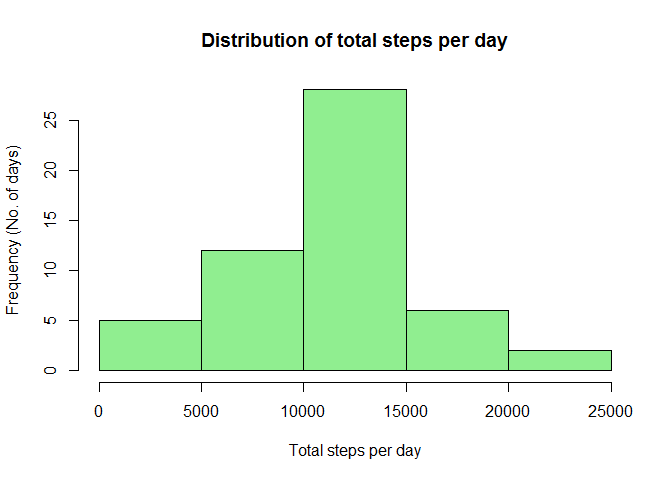
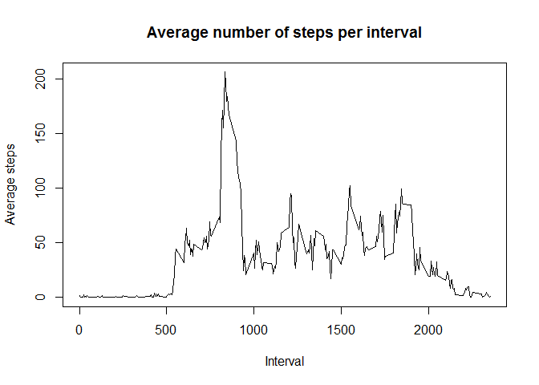
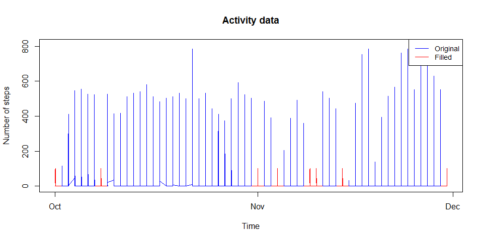
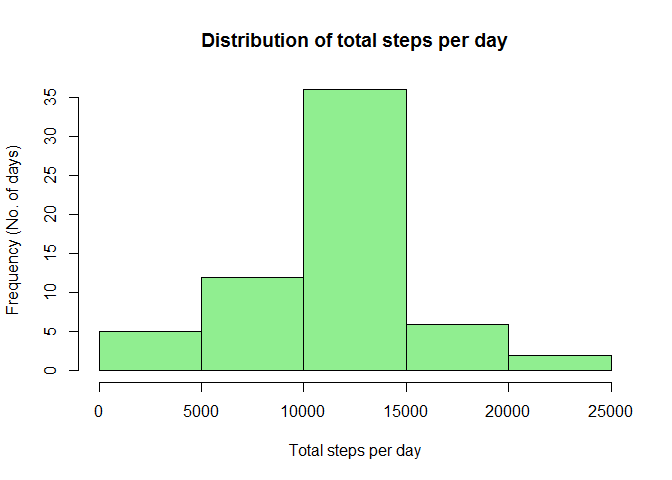
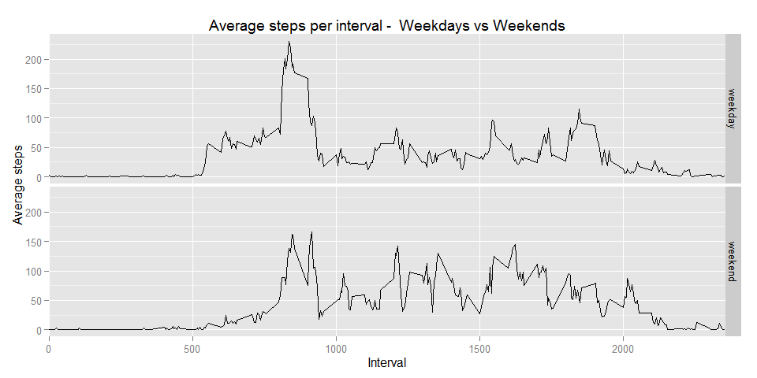

# Reproducible Research: Peer Assessment 1


## Loading and preprocessing the data
The following section loads the data from the file "activity.csv". It must be ensured that this file exists in the working directory (unzip the data). There is no preprocessing necessary.

```r
rm(list=ls()) # clear all variables
data <- read.csv("activity.csv") # read activity data
str(data)
```

```
## 'data.frame':	17568 obs. of  3 variables:
##  $ steps   : int  NA NA NA NA NA NA NA NA NA NA ...
##  $ date    : Factor w/ 61 levels "2012-10-01","2012-10-02",..: 1 1 1 1 1 1 1 1 1 1 ...
##  $ interval: int  0 5 10 15 20 25 30 35 40 45 ...
```


## What is mean total number of steps taken per day?
Calculate and plot the histogram of the total number of steps taken each day

```r
data_date <- split(data, data$date) # split data according to date
total_steps <- lapply(data_date, function(x){sum(x$steps)}) # find total steps per day (date)
hist(as.numeric(total_steps),breaks=5, main="Distribution of total steps per day",col = "lightgreen",
     xlab = "Total steps per day", ylab = "Frequency (No. of days)") # plot histogram of total steps per day
```

 

Calculation of mean of total steps per day

```r
mean_steps <- mean(as.numeric(total_steps), na.rm = T)
mean_steps
```

```
## [1] 10766.19
```

Calculation of median of total steps per day

```r
median_steps <- median(as.numeric(total_steps), na.rm = T)
median_steps
```

```
## [1] 10765
```


## What is the average daily activity pattern?
The following shows the plot of the average number of steps taken per interval across all days

```r
data_interval <- split(data, data$interval) # split data according to interval
mean_interval_steps <- lapply(data_interval, function(x){mean(x$steps,na.rm = T)}) # find average steps per interval
plot(x = as.numeric(names(mean_interval_steps)),y = as.numeric(mean_interval_steps),
     xlab="Interval", ylab="Average steps",main="Average number of steps per interval",type="l") # make a time series plot of the 5-minute interval (x-axis) and the average number of steps taken, averaged across all days (y-axis)
```

 

Computing the 5-minute interval which contains the maximum number of steps on average

```r
names(data_interval)[which(max(as.numeric(mean_interval_steps),na.rm=T) == as.numeric(mean_interval_steps))]
```

```
## [1] "835"
```

## Imputing missing values
Total number of missing values in the dataset

```r
sum(!complete.cases(data$steps)) # finds number of rows where the number of steps is NA
```

```
## [1] 2304
```

Strategy for filling in all of the missing values in the dataset : use mean of intervals across days. This data is already computed earlier and stored in the variable "mean_interval_steps"

```r
head(mean_interval_steps)
```

```
## $`0`
## [1] 1.716981
## 
## $`5`
## [1] 0.3396226
## 
## $`10`
## [1] 0.1320755
## 
## $`15`
## [1] 0.1509434
## 
## $`20`
## [1] 0.0754717
## 
## $`25`
## [1] 2.09434
```

New dataset that is equal to the original dataset but with the missing data filled in (figure shows the change)

```r
data_filled <- data # copy the original data
na_indices <- which(is.na(data$steps)) # find the row indices where steps is NA
inerval_at_na_indices <- data$interval[na_indices] # find interval values corresponding to NAs
data_filled$steps[na_indices] <- unlist(mean_interval_steps[match(inerval_at_na_indices, as.numeric(names(mean_interval_steps)))],use.names = F) # insert at correct row index corresponding mean steps for interval
date_plusTime <- as.POSIXct(paste(data$date, data$interval), format="%Y-%m-%d %M") # add date and time
plot(x=date_plusTime,y=data_filled$steps,type="l",main="Activity data",xlab = "Time",ylab = "Number of steps",col="Red") # plot filled data first
lines(x=date_plusTime,y=data$steps,col="Blue") # plot original data next (gaps, NAs, are ovelayed by filled)
legend(x="topright",legend = c("Original","Filled"),lty=c(1,1),cex=0.9,col=c("Blue","Red")) # add legend
```

 

Histogram, mean and median calculation after filled data

```r
data_filled_date <- split(data_filled, data_filled$date) # split data according to date
total_steps <- lapply(data_filled_date, function(x){sum(x$steps)}) # find total steps per day (date)
hist(as.numeric(total_steps),breaks=5, main="Distribution of total steps per day",col = "lightgreen",
     xlab = "Total steps per day", ylab = "Frequency (No. of days)") # plot histogram of total steps per day
```

 

Calculation of mean of total steps per day

```r
mean_steps_filled <- mean(as.numeric(total_steps), na.rm = T)
mean_steps_filled
```

```
## [1] 10766.19
```

Calculation of median of total steps per day

```r
median_steps_filled <- median(as.numeric(total_steps), na.rm = T)
median_steps_filled
```

```
## [1] 10766.19
```
The mean does not differ since the missing values are replaced by means. The median changes since the number of non-NA elements increases.

## Are there differences in activity patterns between weekdays and weekends?

```r
days <- weekdays(as.POSIXct(data$date, format="%Y-%m-%d"), abbr = T) # convert dates to day of the week
days[which(days %in% c("Sat","Sun"), arr.ind = T)] <- "weekend" # if the day is "sat" or "sun" mark it as weekend
days[which(!(days %in% "weekend"), arr.ind = T)] <- "weekday" # if the day is not weekend" mark it as weekday
days_factor <- as.factor(days) # convert to a factor
print(levels(days_factor))
```

```
## [1] "weekday" "weekend"
```

```r
data_days_interval <- split(data_filled,list(days_factor,data_filled$interval)) # split data according to day-interval combination
mean_interval_steps_days <- lapply(data_days_interval, function(x){mean(x$steps)}) # compute average no. of steps per day-interval  combination
```
The next few steps are to make a proper data frame to make it easier for plotting later

```r
x <- unlist(strsplit(names(mean_interval_steps_days),"[.]"))
y <- matrix(x,nrow=length(x)/2,ncol=2,byrow=T)
z <- cbind(y,mean_interval_steps_days)
all_data = data.frame(y[,1],as.numeric(y[,2]),as.numeric(mean_interval_steps_days))
names(all_data) <- c("days","interval","steps")
head(all_data)
```

```
##      days interval      steps
## 1 weekday        0 2.25115304
## 2 weekend        0 0.21462264
## 3 weekday        5 0.44528302
## 4 weekend        5 0.04245283
## 5 weekday       10 0.17316562
## 6 weekend       10 0.01650943
```


```r
library(ggplot2)
```

```
## Warning: package 'ggplot2' was built under R version 3.1.3
```

```r
g <- ggplot(all_data,aes(interval,steps)) # make plot of avergae steps per interval
g <- g + geom_line() + facet_grid(days~.) + aes(group=1) + scale_x_discrete(breaks = seq(0, max(all_data$interval), by = 500)) # add facets depending on type of day, make it a line plot and ensure the x-ticks are not too close
g + xlab("Interval") + ylab("Average steps") + ggtitle("Average steps per interval -  Weekdays vs Weekends") # add axes labels and titles
```

 
The above shown plots show that the difference between the average steps taken per interval are not strikingly different between weekdays and weekends. The biggest difference is in the fact that the subject is walking more consistently throughout the day during weekends when compared to the weekdays.
